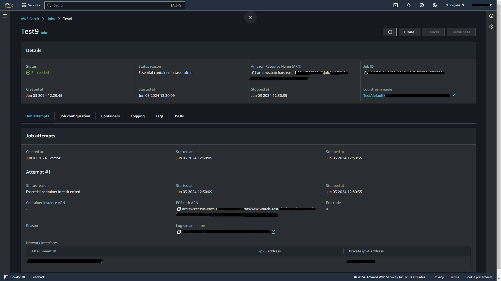

# AWS BATCH FARGATE

Welcome to the AWS Batch data processing showcase using Docker on ECS Fargate with GitHub Actions CI/CD!

In this README, you will find the steps required to set up and configure everything needed. In the Docker folder, you will find the code and files required for creating the Docker container. The YAML GitHub Action configuration file is located in the .github/workflows folder. The "prod" branch is used exclusively for pushing changes into production.

In this example, a Python script is set up within a Docker container to perform data analysis on a payments dataset. The container runs on ECS Fargate by submitting jobs through AWS Batch. With the help of GitHub Actions, a CI/CD pipeline for the Docker Image is established to synchronize the code in the repository with the Docker Image stored in AWS ECR.

One of the key components of this project is to apply best security practices for both the AWS account and the data handled. To achieve this, a system of policies applying the principle of least privilege is used to create different users, enhancing account security in the GitHub Actions integration by assuming STS roles with temporary credentials through the identity provider token. The data is also secured by ensuring it does not traverse the internet and always remains within the AWS Network.


## ➡️ USE CASE

Whether you need to run code for data analysis, make predictions using machine learning, run data mining scripts, pre-process large volumes of data, or handle any type of job with repetitive processes, AWS Batch offers a great option. It allows you to partition your work and potentially schedule jobs to optimize costs, making significant savings on your account.

## ➡️ CONFIGURE LOCAL SETUP

To configure the local setup, first, we create a directory named aws-batch-fargate to organize our project files, then we navigate into this directory.

```sh
mkdir aws-batch-fargate #Create a directory for the proyect
cd aws-batch-fargate #Cd into the directory
git init #Iniate a repository
```

Next, we initialize a Git repository within this directory using the git init command to track changes and enable version control.

```sh
mkdir Docker #Create Docker folder
mkdir .github/workflows #Create .github folder and workflows folfer for github action config
mkdir test-resources #Create a folder for the test dataset
```

We create a Docker folder to store files related to Docker container creation, a .github/workflows folder to house GitHub Actions workflow configuration files, and a test-resources folder for any additional resources or datasets needed for testing purposes. Within the test-resources folder, we download a demo CSV dataset containing payments using the wget command from a publicly accessible URL.

```sh
cd test-resources #Cd into resourcer folder
wget https://raw.githubusercontent.com/Andresmup/ArchivosDataScience/main/payments.csv #Download demo csv dataset with payments
```

## ➡️ CONFIGURE S3 BUCKETS

To set up the S3 buckets, we use the AWS CLI commands. First, we create a bucket named prod-source-payments-for-processing using the aws s3 mb command. Then, we create another bucket named prod-destination-payments-batch-processed. Finally, we upload the local file payments.csv from the test-resources folder to the prod-source-payments-for-processing bucket using the aws s3 cp command. This ensures that our sample dataset is available for processing within the AWS environment.

```sh
aws s3 mb s3://prod-source-payments-for-processing #Create a bucket with name prod-source-payments-for-processing
```

```sh
aws s3 mb s3://prod-destination-payments-batch-processed #Create a bucket with name rod-destination-payments-batch-processed
```

```sh
aws s3 cp test-resources/payments.csv s3://prod-source-payments-for-processing #Upload the local content test-resources/payments.csv to the bucket prod-source-payments-for-processing
```

## ➡️ DOCKER DEV

To set up the Docker environment for development, we first navigate into the Docker folder using cd Docker. Within this folder, we create essential files for Docker container creation: a Dockerfile using the touch command, which specifies the configuration of our Docker image; a main.py Python file for our code implementation; and a requirements.txt file listing the required libraries for our Python code.

```sh
cd Docker #Create a folder for Docker
touch Dockerfile #A Dockerfile is required
touch main.py #Create python file for code
touch requirements.txt #Text file for libraries required
```

Once these files are in place, we build the Docker image using the docker build command with the -t flag to tag the image with the name aws-batch-payment-processing. This step compiles the Dockerfile and sets up the environment specified, ensuring that our Docker image is ready for use in AWS Batch processing.

```sh
docker build -t aws-batch-payment-processing .
```

## ➡️ LOCAL TEST AND SETUP

For local testing and setup, it's crucial to note that AWS credentials must be loaded into the ~/.aws directory for this command to function properly. Docker needs access to these credentials to interact with AWS services.

With the credentials in place, we run the following command:

```sh
docker run --rm -v ~/.aws:/root/.aws aws-batch-payment-processing orders-dataset-for-batch-processing payments.csv results-batch-payment-processing results.json
```

This command runs a Docker container using the aws-batch-payment-processing image. It processes the payments.csv dataset located in the orders-dataset-for-batch-processing bucket on AWS S3. The results of the processing are stored in the results-batch-payment-processing bucket, and the output is saved as results.json. The --rm flag ensures that the container is removed after execution, and the -v flag mounts the AWS credentials directory into the container's filesystem, enabling access to the necessary credentials for interaction with AWS services.

## ➡️ ECR MANUAL SETUP

To set up the Amazon Elastic Container Registry (ECR) manually, follow these steps:

Create a repository named batch-payment-processing using the AWS CLI command:

```sh
aws ecr create-repository --repository-name batch-payment-processing
```
Retrieve your AWS account ID using the following command:

```sh
aws_account_id=$(aws sts get-caller-identity --query "Account" --output text)
```

Log in to the ECR repository by obtaining a login password for the docker login command:

```sh
aws ecr get-login-password --region us-east-1 | docker login --username AWS --password-stdin $aws_account_id.dkr.ecr.us-east-1.amazonaws.com
```

Tag the Docker image batch-payment-processing:latest with the ECR repository URI:

```sh
docker tag batch-payment-processing:latest $aws_account_id.dkr.ecr.us-east-1.amazonaws.com/batch-payment-processing:latest
```

Push the Docker image to the ECR repository:

```sh
docker push $aws_account_id.dkr.ecr.us-east-1.amazonaws.com/batch-payment-processing:latest
```

These commands create a repository in ECR, log in to the repository, tag the Docker image, and push it to the repository. Ensure you replace us-east-1 with the appropriate AWS region if needed.

## ➡️ POLICY AND ROLE CREATION

### Setup

To begin, we create the necessary policy files:

```sh
touch policy-prod-source.json
touch policy-prod-dest.json
touch policy-get-token.json
touch policy-push-ecr.json
```

### Policies

AllowGetObjectsProdSourcePaymentBucket - policy-prod-source.json

This policy allows reading objects from the prod-source-payments-for-processing S3 bucket.

```json
{
    "Version": "2012-10-17",
    "Statement": [
        {
            "Effect": "Allow",
            "Action": "s3:GetObject",
            "Resource": "arn:aws:s3:::prod-source-payments-for-processing/*"
        }
    ]
}
```

AllowPutObjectProdDestinationPaymentBucket - policy-prod-dest.json

This policy permits writing objects to the prod-destination-payments-batch-processed S3 bucket.

```json
{
    "Version": "2012-10-17",
    "Statement": [
        {
            "Effect": "Allow",
            "Action": "s3:PutObject",
            "Resource": "arn:aws:s3:::prod-destination-payments-batch-processed/*"
        }
    ]
}
```

AllowGetTokenECRLogin - policy-get-token.json

This policy grants permissions to retrieve authorization tokens for Amazon Elastic Container Registry (ECR) login.

```json
{
    "Version": "2012-10-17",
    "Statement": [
        {
            "Sid": "GetAuthorizationToken",
            "Effect": "Allow",
            "Action": [
                "ecr:GetAuthorizationToken"
            ],
            "Resource": "*"
        }
    ]
}
```

AllowPushOnlyBatchPaymentProcessing - policy-push-ecr.json

This policy restricts permissions to only allow pushing Docker images to the batch-payment-processing repository in Amazon ECR.

```json
{
    "Version": "2012-10-17",
    "Statement": [
        {
            "Sid": "AllowPushOnly",
            "Effect": "Allow",
            "Action": [
                "ecr:GetDownloadUrlForLayer",
                "ecr:BatchGetImage",
                "ecr:BatchCheckLayerAvailability",
                "ecr:CompleteLayerUpload",
                "ecr:InitiateLayerUpload",
                "ecr:PutImage",
                "ecr:UploadLayerPart"
            ],
            "Resource": "arn:aws:ecr:us-east-1:604476232840:repository/batch-payment-processing"
        }
    ]
}
```

Lastly, we create these policies in IAM:

```sh
aws iam create-policy --policy-name AllowGetObjectsProdSourcePaymentBucket --policy-document file://policy-prod-source.json
aws iam create-policy --policy-name AllowPutObjectProdDestinationPaymentBucket --policy-document file://policy-prod-dest.json
aws iam create-policy --policy-name AllowGetTokenECRLogin --policy-document file://policy-get-token.json
aws iam create-policy --policy-name AllowPushOnlyBatchPaymentProcessing --policy-document file://policy-push-ecr.json
```

These commands create IAM policies based on the defined JSON documents, providing granular permissions for accessing AWS resources as required by our setup.

### Roles

This role is assumed by the GitHub Actions machine to push Docker images to Amazon ECR. The trust policy allows GitHub Actions to assume the role using Web Identity Federation. We attach the policies AllowGetTokenECRLogin and AllowPushOnlyBatchPaymentProcessing to grant necessary permissions.

```sh
aws iam create-role --role-name github-action-machine-push-ecr-image --assume-role-policy-document '{
    "Version": "2012-10-17",
    "Statement": [
        {
            "Effect": "Allow",
            "Principal": {
                "Federated": "arn:aws:iam::$aws_account_id:oidc-provider/token.actions.githubusercontent.com"
            },
            "Action": "sts:AssumeRoleWithWebIdentity",
            "Condition": {
                "StringEquals": {
                    "token.actions.githubusercontent.com:aud": "sts.amazonaws.com"
                },
                "StringLike": {
                    "token.actions.githubusercontent.com:sub": "repo:<github_account>/<repository>:*"
                }
            }
        }
    ]
}'

aws iam attach-role-policy --role-name ecsS3ProdPayment --policy-arn arn:aws:iam::$aws_account_id:policy/AllowGetTokenECRLogin
aws iam attach-role-policy --role-name ecsS3ProdPayment --policy-arn arn:aws:iam::$aws_account_id:policy/AllowPushOnlyBatchPaymentProcessing
```

This role is assumed by ECS tasks to interact with AWS services such as S3 and ECR. The trust policy allows ECS tasks to assume the role. We attach the policies AllowPushOnlyBatchPaymentProcessing and AllowPutObjectProdDestinationPaymentBucket to grant necessary permissions.

```sh
aws iam create-role --role-name ecsS3ProdPayment --assume-role-policy-document '{
    "Version": "2012-10-17",
    "Statement": [
        {
            "Sid": "",
            "Effect": "Allow",
            "Principal": {
                "Service": "ecs-tasks.amazonaws.com"
            },
            "Action": "sts:AssumeRole"
        }
    ]
}'

aws iam attach-role-policy --role-name ecsS3ProdPayment --policy-arn arn:aws:iam::$aws_account_id:policy/AllowPushOnlyBatchPaymentProcessing
aws iam attach-role-policy --role-name ecsS3ProdPayment --policy-arn arn:aws:iam::$aws_account_id:policy/AllowPutObjectProdDestinationPaymentBucket
```

This role is assumed by ECS tasks to execute tasks on EC2 instances. It has the necessary permissions to run ECS tasks. The trust policy allows ECS to assume the role.

```sh
aws iam create-role --role-name ecsTaskExecutionRole --assume-role-policy-document '{
    "Version": "2012-10-17",
    "Statement": [
        {
            "Effect": "Allow",
            "Principal": {
                "Service": "ec2.amazonaws.com"
            },
            "Action": "sts:AssumeRole"
        }
    ]
}' --description "Role for ecs execution" --max-session-duration 3600 --permissions-boundary "arn:aws:iam::aws:policy/service-role/AmazonECSTaskExecutionRolePolicy"
```

This role is the default service role for ECS, allowing ECS to manage resources on behalf of the user. The trust policy allows ECS to assume the role

```sh
aws iam create-role --role-name AWSServiceRoleForECS --assume-role-policy-document '{
    "Version": "2012-10-17",
    "Statement": [
        {
            "Effect": "Allow",
            "Principal": {
                "Service": "ecs.amazonaws.com"
            },
            "Action": "sts:AssumeRole"
        }
    ]
}' --description "AWSServiceRoleForECS" --max-session-duration 3600 --permissions-boundary "arn:aws:iam::aws:policy/aws-service-role/AmazonECSServiceRolePolicy"
```

This role is the default service role for AWS Batch, allowing Batch to manage resources on behalf of the user. The trust policy allows Batch to assume the role.

```sh
aws iam create-role --role-name AWSServiceRoleForBatch --assume-role-policy-document '{
    "Version": "2012-10-17",
    "Statement": [
        {
            "Effect": "Allow",
            "Principal": {
                "Service": "batch.amazonaws.com"
            },
            "Action": "sts:AssumeRole"
        }
    ]
}' --description "AWSServiceRoleForBatch" --max-session-duration 3600 --permissions-boundary "arn:aws:iam::aws:policy/aws-service-role/BatchServiceRolePolicy"
```

These commands create the necessary IAM roles with appropriate trust policies and attach the required policies to grant permissions as needed for our setup.

## ➡️ GITHUB ACTION CONFIG

To set up the GitHub Actions workflow for pushing Docker images to Amazon ECR, follow these steps:

Switch to the prod branch and push it to the remote repository:

```sh
git checkout -b prod
git push -u origin prod 
```

Create the workflow file:

```sh
touch .github/workflows/publish-container.yaml 
```

Copy and paste the following YAML configuration into the publish-container.yaml file:

```yaml
# Name of the GitHub Actions workflow
name: Docker image for ECR

# Trigger this workflow on pushes to the 'prod' branch
on:
  push:
    branches:
      - prod

# Define permissions for the workflow
permissions:
  id-token: write  # Allow writing ID tokens
  contents: read   # Allow reading repository contents

# Define the jobs to be run in this workflow
jobs:
  build_and_publish:
    # Use the latest version of Ubuntu to run the job
    runs-on: ubuntu-latest
    steps:
      # Step to checkout the repository
      - name: Checkout Repo
        uses: actions/checkout@v4

      # Step to configure AWS credentials
      - name: Connect to AWS
        uses: aws-actions/configure-aws-credentials@v4
        with:
          role-session-name: aws-push-ecr-session          # Name of the session for assuming the role
          role-to-assume: ${{ secrets.AWS_IAM_ROLE }}      # IAM role to assume, stored in GitHub secrets
          aws-region: ${{ secrets.AWS_REGION }}            # AWS region, stored in GitHub secrets

      # Step to login to Amazon ECR
      - name: Login to Amazon ECR
        id: login-ecr
        uses: aws-actions/amazon-ecr-login@v2

      # Step to build, tag, and push the Docker image to Amazon ECR
      - name: Build, tag, and push docker image to Amazon ECR
        env:
          REGISTRY: ${{ steps.login-ecr.outputs.registry }}        # ECR registry URL from the login step
          REPOSITORY: ${{ secrets.AWS_ECR_REPOSITORY }}            # ECR repository name, stored in GitHub secrets
          IMAGE_TAG: ${{ github.sha }}                             # Git commit SHA as the image tag
        run: |
          cd Docker                                                # Navigate to the Docker directory
          docker build -t $REGISTRY/$REPOSITORY:$IMAGE_TAG .       # Build the Docker image
          docker tag $REGISTRY/$REPOSITORY:$IMAGE_TAG $REGISTRY/$REPOSITORY:latest  # Tag the image as 'latest'
          docker push $REGISTRY/$REPOSITORY:$IMAGE_TAG             # Push the image with the commit SHA tag
          docker push $REGISTRY/$REPOSITORY:latest                 # Push the image with the 'latest' tag
```

Setup the necessary secrets in the GitHub repository:

> AWS_ECR_REPOSITORY with the ARN of the ECR Repo

> AWS_IAM_ROLE with the ARN of the role to assume

> AWS_REGION with the region (eg: us-east-1)

To obtain the AWS_IAM_ROLE, ensure that GitHub is set up as an Identity Provider pointing to your repository. With these configurations in place, the GitHub Actions workflow will automatically trigger when changes are pushed to the prod branch, building and pushing the Docker image to Amazon ECR accordingly.

## ➡️ AWS BATCH SETUP

These commands configure AWS Batch to manage the execution of your jobs. Ensure that the VPC, subnets, security groups, and IAM roles are correctly configured and replace the placeholders with actual values.

Create a VPC endpoint for Amazon S3:

This command creates a VPC endpoint in a specific VPC (vpc-0b44a2428eb1e2f07) for the Amazon S3 service (com.amazonaws.us-east-1.s3). VPC endpoints enable instances within the VPC to securely access Amazon S3 without needing to traverse the public internet. It ensures secure and low-latency access to S3 services.

```sh
aws ec2 create-vpc-endpoint \
--vpc-id vpc-0b44a2428eb1e2f07 \
--service-name com.amazonaws.us-east-1.s3
```

Create a compute environment for Fargate processing:

This command creates a managed compute environment named FargateProcessing for AWS Batch. Fargate allows you to run containers without managing the underlying infrastructure. AWS handles provisioning and scaling of the environment automatically. Here, we specify Fargate as the type, maximum vCPUs, subnets where tasks will run, and security group IDs.

```sh
aws batch create-compute-environment \
--compute-environment-name FargateProcessing \
--type MANAGED \
--state ENABLED \
--compute-resources type=FARGATE,maxvCpus=1,subnets=subnet-02207f9fc63571a2a,subnet-01668d4e4573f5b0d,subnet-087cec452a2904873,subnet-0a6f8f4ff98c77bc1,subnet-0f7281e79acfe10b3,subnet-03586428c9f634bef,securityGroupIds=sg-0e8f442b689afa58b \
--service-role arn:aws:iam::$aws_account_id:role/aws-service-role/batch.amazonaws.com/AWSServiceRoleForBatch
```

Create a job queue:

A job queue in AWS Batch is a logical grouping of jobs that share the same execution parameters. It's used to prioritize and schedule jobs within AWS Batch. In this command, we create a job queue named TestQueue, set its state to ENABLED, specify its priority, and associate it with the compute environment created earlier.

```sh
aws batch create-job-queue \
--job-queue-name TestQueue \
--state ENABLED \
--priority 1 \
--compute-environment-order order=1,computeEnvironment=arn:aws:batch:us-east-1:$aws_account_id:compute-environment/Test
```

Create a job definition file:

This command creates an empty file named job-definition.json where we will define the specifications for our AWS Batch job.

```sh
touch job-definition.json
```

Define the job specification in JSON format:

This JSON defines the job definition named "Test" for a containerized job. It specifies various parameters such as the Docker image to use, the command to execute within the container, the IAM roles for the job and execution, resource requirements, network configuration for Fargate, platform capabilities, and container orchestration type.

```json
{
  "jobDefinitionName": "Test",
  "type": "container",
  "containerProperties": {
    "image": "$aws_account_id.dkr.ecr.us-east-1.amazonaws.com/batch-payment-processing:latest",
    "command": [
      "--source_bucket",
      "prod-source-payments-for-processing",
      "--source_file",
      "payments.csv",
      "--destination_bucket",
      "prod-destination-payments-batch-processed",
      "--destination_file",
      "results.json"
    ],
    "jobRoleArn": "arn:aws:iam::$aws_account_id:role/ecsS3ProdPayment",
    "executionRoleArn": "arn:aws:iam::$aws_account_id:role/ecsTaskExecutionRole",
    "resourceRequirements": [
      {
        "value": "1.0",
        "type": "VCPU"
      },
      {
        "value": "2048",
        "type": "MEMORY"
      }
    ],
    "networkConfiguration": {
      "assignPublicIp": "ENABLED"
    },
    "fargatePlatformConfiguration": {
      "platformVersion": "LATEST"
    },
    "runtimePlatform": {
      "operatingSystemFamily": "LINUX",
      "cpuArchitecture": "X86_64"
    }
  },
  "platformCapabilities": [
    "FARGATE"
  ],
  "containerOrchestrationType": "ECS"
}
```

Register the job definition with AWS Batch:

This command registers the job definition specified in the JSON file with AWS Batch. Once registered, you can use this job definition to submit jobs to AWS Batch.

```sh
aws batch register-job-definition --cli-input-json file://job-definition.json
```

Submit a job to the job queue:

This command submits a job named "TestJobExecution" to the job queue named "TestQueue" in AWS Batch. It specifies the job definition to use for this job. Upon submission, AWS Batch will schedule and execute the job according to the defined parameters in the job definition.

```sh
aws batch submit-job \
--job-name TestJobExecution \
--job-queue arn:aws:batch:us-east-1:$aws_account_id:job-queue/Test \
--job-definition arn:aws:batch:us-east-1:$aws_account_id:job-definition/Test:
```

## ➡️ CONSOLE MANAGEMENT CAPTURE

